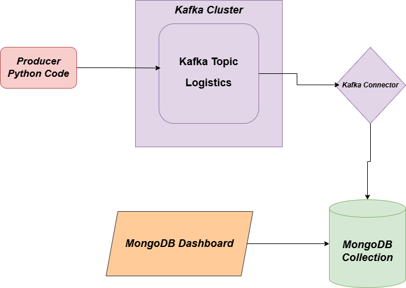
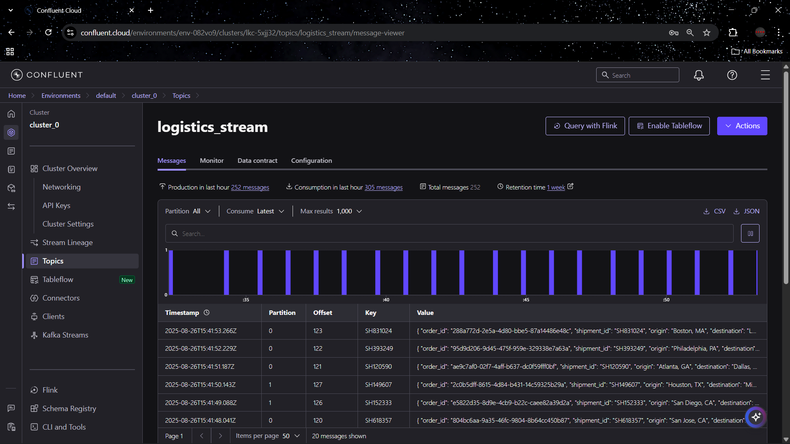
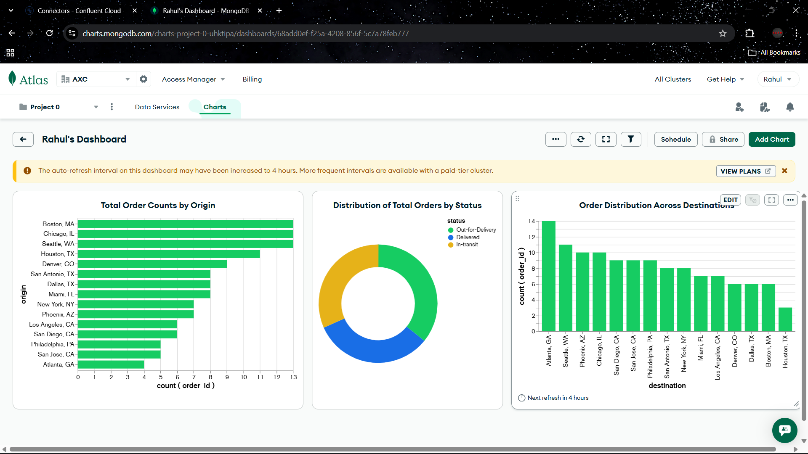

# Real Time Logistics Producer Consumer Pipeline with MongoDB Dashboard.

### About

This small sinple project demonstrates a real-time data pipeline using Apache Kafka, Kafka Connect, and MongoDB. A custom Python producer publishes records into a Kafka topic, which are then ingested into a MongoDB collection through Kafka Connect. Finally, the stored data is visualized using a MongoDB dashboard, enabling seamless data flow from production to storage and analysis.

1. The python code produces Logistics Shipment data and use API keys to connect to Kafka and publish the records into Kafka Topic in **AVRO** format.
   The python file can be found here - [Python File Link](mock_logistics_data_producer.py)

2. Next we can see the records being published into the Kafka Topic.

  
  

3. Then we set up our Kafka Connector into MongoDb sink. The records go from topic into MongoDB collection. Then I used MongoDB Charts generative AI to create the visualization for a dashboard.
   
   

   If you want to see real time video of the project click on the link -> [Linkedin Video]()
   

